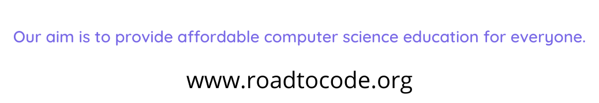

<!-- HEADER -->
<p align="center">
  
</p>

# Lecture-11 Comparison/Relational Operators,Indentation,Conditional Statements(if,if--else) in Python

## Comparison/Relational Operators

Comparison operators are to test the condition. The conditional operator result as boolean True or False.

### Difference between = and == operators in Python

The “ = ” is an assignment operator is used to assign the value on the right to the variable on the left. 

The ‘==’ operator checks whether the two given operands are equal or not.

* equals to (==)
```python
a=10
b=10
result= a==b
print(result)
```
* less than ( < )
```python
a=10
b=20
result= a<b
print(result)
```
* greater than ( > )
```python 
a=30
b=20
result= a>b
print(result)
```
* less than or equal to ( <= )
```python
a=10
b=20
result= a<=b
print(result)
```
* greater than or equal to ( >= )
```python
a=50
b=20
result= a>=b
print(result)
```
* not equal to 
```python
a=50
b=20
result= a!=b
print(result)
```

## Indentation

Python relies on indentation (whitespace at the beginning of a line) to define scope in the code. Other programming languages often use curly-brackets for this purpose.

## Conditional Statements

* if Statement=
 ```python
 Syntax=
 if condition :
     statements-1
     statements-2
     .....
     .....
     statements-n
```
```python
Example=
a=20
b=20
if a==b:
  print("A is Equals to B ")
```
* if--else Statements
```python
if condition :
     statements-1
     statements-2
     .....
     .....
     statements-n
else:
    statements-1
     statements-2
     .....
     .....
     statements-n
```
```python
a=20
b=30
if a==b:
  print("A is Equals to B ")
else :
   print("B is Unequals to A ")
```
```python
a=50
b=30
if a>b:
  print("A is greater than B")
else :
  print("B is greater than to A ")
```
## 🏠 HomeWork
>🚁Write a program to check whether applicant is eligible for voting or not using if statments.
>🛰️Write a program to cheak whether entered number is even ir odd by using if-else statment.

## 🔗 Some Useful Links

## 📖 References

<!-- FOOTER -->
<p align="center">
  
</p>  